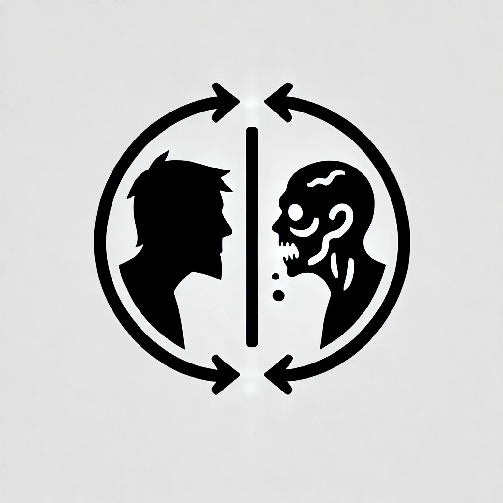

# Sync or Bite

Sync or Bite is project belonging to the Advanced programming course made by [Alejandro López](https://github.com/alejandrolm18) y [Guillermo Ramos](https://github.com/Promete04).  This repository contains all the source code, and required documentation in order to reflect the development process.

## Documentation

The `docs/` directory contains the essential project documentation, providing a comprehensive guide to the development and design of Sync or Bite. The documentation includes a development diary and the following elements to ensure a thorough understanding of the project's structure and functionality:

* High-level analysis
* General design and synchronization tools
* Main classes
* Class diagram
* Source Code

## Class diagram 

 

> To see properly the class diagram, download it and open it in your PC.

